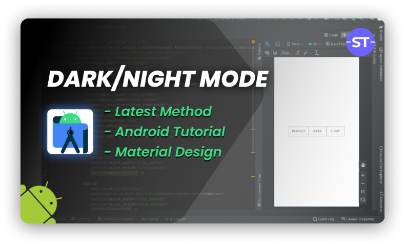

# DarkTheme
A demo android studio project which implements the functionality of switching between dark and light theme in android application.

### Watch video
[](https://www.youtube.com/watch?v=bWLnf2nqTl4 "Dark theme demo on android app")

<br/>
<h3>Dependencies</h3>

add the following dependency in your ```build.gradle(Module:app)``` file

```
dependencies {
   implementation 'com.google.android.material:material:1.2.1'
}
```

or get latest [dependency](https://material.io/develop/android/docs/getting-started) 

